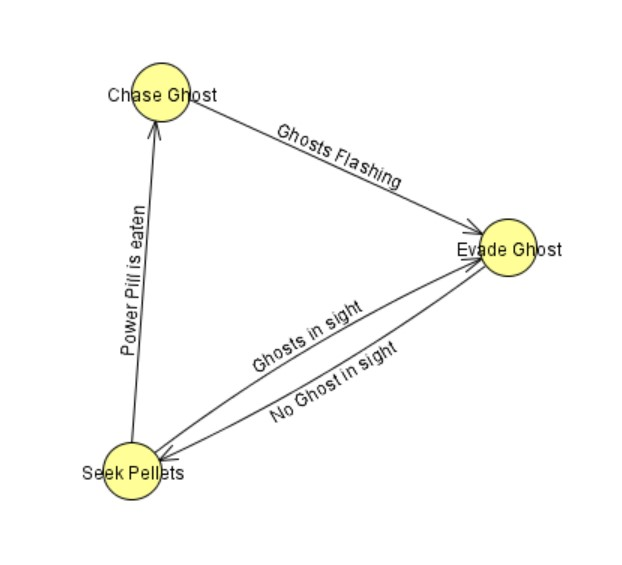

# Ms Pacman AI and Games
This repository is oriented to college studients and only for knowledge purposes. In this respository we will work under *MsPacman, (Namco.-1981)* running some Artificial Intelligents methods such as **search trees**, **neuronal network** or **automatas**.

This repository is based (and is where the information is extracted) on the book ***Artificial Intelligence and Games*** by *Georgios N. Yannakakis* and *Julian Togelius*: http://gameaibook.org/

Also, using the **MsPacman Framework** by *kefki*: https://github.com/kefik/MsPacMan-vs-Ghosts-AI

## 1. Finite State Machine 
The FSM used in this first method is the following.

The initial state will always be *Seek Pellets*, in this state, MsPacman will eat randomly the maximum pellets in the path.

Once a Power Pill is eaten, the automata goes to state *Chase Ghost* where MsPacman start to chase the ghost (because they are edible at that time).

Finally, the state *Evade Ghost* will be reached out when the ghosts are flashing (while we are in *Chase Ghost* state) and if any ghost is in sight if we are in *Seek Pellets* state. We can reach out this state too if we are in *Seek Pellets* and we have any ghost in sight.

To try this method, call the main of the class FiniteStateMachine.

Making the states was easy, but the transitions between them have more things to be careful that it seems. For this reason, some transitions are not exactly as the graph seen.

First of all, the transition *PowerPill is eaten* is implemented as the graph, no variations. The transition **Ghost Flashing** was made empirically, so the variable *TIME_FLASH* was created to vary the time MsPacman guess she should run from the ghosts.

**Ghosts in sight** was made by a certain distance represented by the variable *VISIBLE_DISTANCE*.

Finally, we must say that the transition *Ghost Flashing* has in mind only the Nearest Ghost who is edible (or if any Ghost is still Edible) and the transition *Ghosts in sight* only the NOT edible ghosts.

## 2. Monte Carlo Tree Search

Next, we will implement the **Monte Carlo Tree Search**. For the implementation we will use **generic trees** to represent the data space for Monte Carlo and to make the search easier.

Monte Carlo Search Tree has 4 stages:

1. **Select**. We decide which node we must to expand.

2. **Expansion**. We expand that node.

3. **Simulation**. We take random actions tiluntil a terminal state is reach.

4. **BackPropagation**. The outcome of each node is added to the actual node and its parent and "it is backed up" until we reach the root node.

The Heuristic Function will be ruled by this formula:

                          HEURISTIC FUNCTION
	    Current SCORE of the game - 1.500 x (Lives Lost). 
		     10.000 (if WIN) // -10.000 (if LOSE)

